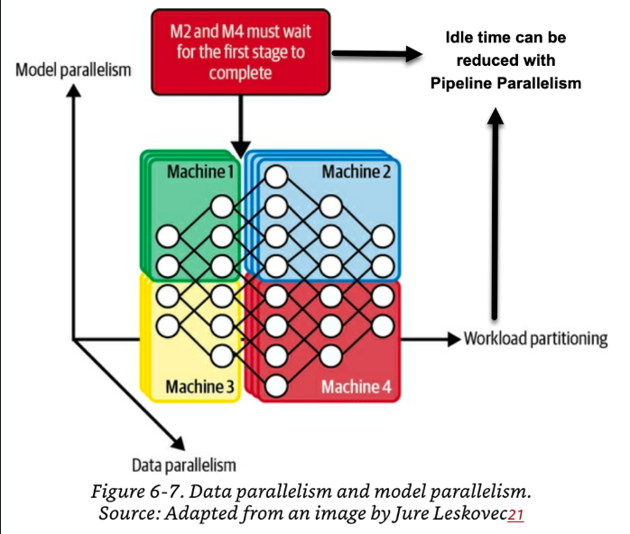
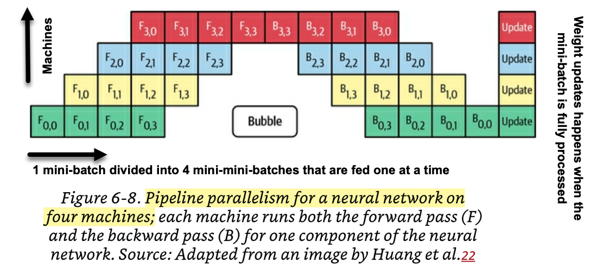
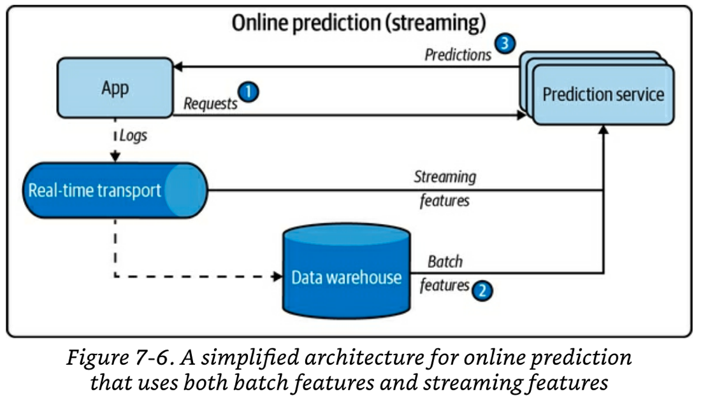
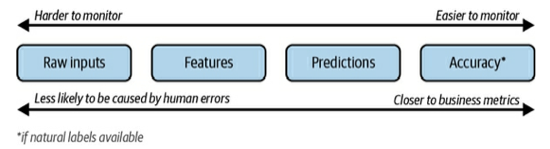

## 🔗 Quick-Reference Sources
- *Airbnb Case Study:* [Using Machine Learning to Predict Value of Homes on Airbnb](https://medium.com/airbnb-engineering/using-machine-learning-to-predict-value-of-homes-on-airbnb-9272d3d4739d)
- **Chip Huyen DMLS:** [Granular Bulleted Summaries (Ch. 7-9)](https://github.com/serodriguez68/designing-ml-systems-summary)
- **Drift Implementation Blueprint:** [Evidently AI ML Monitoring Guide](https://www.evidentlyai.com/ml-in-production/model-monitoring)

---

## 📝 Study Scratchpad

### Basic ML Review

A model is a function that turns inputs into outputs, which are then used to make predictions.  
    In supervised ML, inputs and outputs are given as data, and the function is derived from the data. Still need to specify the form that the function should take eg. linear function, decision tree, neural network  
Parameters are values for the model function that are learned during the training process.  
    Need an objective func to evaluate params, aka loss func  
    Also need learning procedure to derive the set of parameters best suited for data  
Model Selection isnot just selecting function. Also involves picking right objective function and learning procedure  
    while developing model, if time permits, you should experiment with diff objective funcs to see how model behaviour changes globally or for subsets of data  
    learning procedures (eg. gradient descent) and optimizers (eg. momentum/adam/rmsprop)  
    the set of params that perform well on training data aren't always the best, a diff set might perform better in production      


### Airbnb case study

Data products (eg.personalized search ranking for guests, smart pricing for hosts) are useful but costly to make.  
Advances in ML infra lowered the cost to deploy new ML models to production  
    - a general feature repository so that u can reuse features that u know are high quality (cuts time on feature engineering)  
    - AutoML tools being used by data scientists (speeds up model selection and performance benchmkarking)  
    - a framework to automatically translate Jupyter notebooks into Airflow pipelines  
Specific Case: LTV modeling - predicting the value of homes on airbnb  
    LTV -> Lifetime Value, projected currency value of a user for a fixed time horizon. Companies like Spotufy use it to make pricing decisions. Airbnb uses user's LTVs to:  
        allocate budget across diff marketing channels efficiently,   
        calc more precise bidding prices for online marketing based on keywords  
        create better listing segments
    Calculating historical value of existing listings can be done using past data, they decided to predict LTV of new listing using ML

#### ML Workflow for LTV Modeling    

Feature Engineering -> Model Training -> Model Selection & Validation -> Productionization  

##### Feature Engineering - Define relevant features
(airbnb's internal feature repo - Zipline)
one of the first step in any supervised ml project is to define relevant features, correlated w the outcome variable, aka feature engineering. eg. In predicting LTV u might compute the percent of the next 180 calendar dates that a listing is available or a listing's price relative to comparable listings in the same market  
Tedious - requires domain specific knowledge, not easily shareable/reusable
solution, Zipline - a training feature repository that provides features at diff levels of granularity (host, guest, listing, or market level). 
Crowdsourced, allowing data scientists to use features prepared/vetted by others for past projects. IF a feature is not available, a user can create their own. When multiple features are reqiured fora training set, zipline automaically performs key joins and backfills the training data behind the scenes. 
##### Prototyping and Training - Train a model prototype
Before fitting a model, data processing needs to happen. Data imputation to deal w missing values & encoding categorical variables (if few categories, one-hot-encoding. if many, ordinal encoding)
For prototyping, we don't know the best set of features to use so its important to write code that allows for rapid iteration.  
    The pipeline constuct is useful for prototyping. [Pipelines](http://scikit-learn.org/stable/modules/compose.html#pipeline-chaining-estimators) allow data scientists to specify high level blueprints that describe how features should be transformed and which models to train. At a high level, pipelines are used to specify data transformations for diff types of features.   
    The advantage of using pipelines is that:    
        1. data transformations are abstracted away     
        2. ensures that data is transformed consistently across training and scoring, solving the problem of data transformation inconsistency when translating a prototype into production     
        3. separate data transformations from model fitting
        4. data scientists can add a final step to specify an estimator for model fitting 
```python
# Example snippet from LTV model pipeline
            transforms = []

            transforms.append(
                ('select_binary', ColumnSelector(features=binary))
            ) # binary features can be appended directly 

            transforms.append(
                ('numeric', ExtendedPipeline([
                    ('select', ColumnSelector(features=numeric)),
                    ('impute', Imputer(missing_values='NaN', strategy='mean', axis=0)),
                ]))
            ) # numeric features need a pipeline to perform data imputation

            for field in categorical:
                transforms.append(
                    (field, ExtendedPipeline([
                        ('select', ColumnSelector(features=[field])),
                        ('encode', OrdinalEncoder(min_support=10))
                        ])
                    )
                ) #  categorical features need a pipeline to perform encoding
                
            features = FeatureUnion(transforms) # FeatureUnion simply combines the features columnwise to get the final training dataset
```  
##### Model Selection & Validation - Performing model selection and tuning    
need to decide which candidate model is the best to put into production     
to do so, weigh the tradeoffs bw model interpretability and complexity eg. sparse linear model might be v interpretable but not complex enough to generalize well, whereas a tree based model might be flexible enough to capture nonlinear patterns but not v interpretable. This is known as Bias-Variance tradeoff.  
    In applications such as insurance or credit screening, its imp for model to be transparent and interpretable to ensure fairness. In applications such as image classification, it is more imp to have a performant classifier than an interpretable model.  
To speed up the process of model selection, they experimented using various AutoML frameworks and found that XGBoost outperformed benchmark models significantly. Since the task was to predict listing values, they productionized their final model using XGBoost, which favors flexibility over interpretability.   
##### Productionization - Take the selected model prototype to production  
ML Automator - Airbnb's notebook translation framework  
building a production pipeline way more complex than a prototype on a local laptop:  
1. how to perform periodic re-training?  
2. how to score a large no of examples efficiently?  
3. how to build a pipeline to monitor model performance over time?

ML Automator was built to automatically translate a jupyter notebook into an Airflow ML pipeline. This framework was designed specifically for data scientists who are already familiar w writing prototypes in python and want to take their model to production w limited exp in data engineering.  
The requirements for this framework are: user must specify a model config in the notebook to tell the framework where to locate training table, how many resources to allocate for training and how scores will be computed, and secondly data scientists are required to write specific fit and transform functions. fit() specifies exactly how training will be done. transform() will be wrapped as a python UDF for distributed scoring if needed. 
ML Automator wraps the notebook inside a python udf and creates and airflow pipeline. Data engineering tasks such as data serialization, scheduling of periodic re-training, distributed scoring, are all encapsulated as a part of this daily batch job. This significantly lowers the cost of model development for data scientists, like a dedicated data engineer to help w productionization.   
##### Topics not covered    
Tracking model performance over time, leveraging elastic compute environment for modeling etc.  

#### Final Takeaways  
1. Thanks to the collaboration of data scientists and ML infra, the cost of model development is significantly lower. Zipline - feature engineering, Pipeline - model prototyping, AutoML - model selection & benchmarking, ML Automator - productionization.  
2. Notebook driven design reduces barrier to entry. Notebooks used in production are guaranteed to be correct, self-documenting and up-to-date, resulting in strong adoption from new users.  
3. Teams are willing to invest more in ML product ideas. 


### DMLS CH6

#### Criteria to select ML models

model must be suitable for the problem 
eg. fraud detection system -> anomly detection problem -> models used for this kind of problem are KNNs, isolation forest, clustering, and neural network
eg.2 NLP text claassification -> naive-bayes, log reg, rnns, BERT or GPT

start w simpler models, make it better by optimizing objective funcs, hyper-paramters search, feature eng, ensembles
move to complex models once u reach the limit of a simple one

training metrics not everything -> consider amt of data needed, computational needs, training time, latency, interpretability etc. 

USE SIMPLER SOLUTION (state-of-the-art models dont always hold up in prod)

neural networks can be used alongside classical models eg. extracting features, ensembles, embeddings

START SIMPLE - validate framing early, easier to understand, baseline for comparison
simple =/= low-effort (sometimes u want a low-effort, complex model as starting pt)

best model now vs best model 2 months from now. model performance saturates - simple models saturate faster. take into account future improvement potential

tradeoffs -> false positives vs false negatives, compute vs performance, latency vs performance, interpretability vs performance

understand assumptions!!!


#### Ensembles - Bagging vs Boosting vs Stacking

multiple base learners are trained and each of them outputs a prediction, the final pred is derived using majority vote
harder to deploy/maintain - useful for tasks where small performance boosts can lead to huge financial gain

less correlation bw base learners -> better. common to use diff models for an ensemble eg. tranformer, rnn & xgboost tree can all be part of one ensemble. use odd no of models to avoid voting ties 

##### Bagging ->
bootstrap data (sample w replacement) to create diff training data sets and train a diff model on each set. 
improves stability of unstbale methods, accuracy & reduces variance (helps avoid overfitting) 
! can mildly degrade performance in stable methods like knn

##### Boosting->
Train the first weak classifier on the original dataset, samples are then reweighted acc to how well they are classified. misclassified ones have higher weights. 
Train a 2nd classifier w the reweighted samples. Reweight samples again. Repeat for n iterations.  
The final strong classifier is a weighted combination of all the existing classifiers. Classifiers with smaller training errors have higher weights.
eg. Gradient Boosted Machines (GBMs), XGBoost, LightGBM

##### Stacking ->
Multiple base learners make prediction on k-fold CV data.
The final prediction uses meta-learner which combines the predictions from the base ones. It may use the original features as well to guide its predictions. 


#### Experiment Tracking, Versioning, Debugging

##### Tracking
expmt tracking - process of tracking progress and result of an exp
versioning- process of logging all the config params of an exp for replicability
helps w reproducibility but does not ensure it

what to track / babysit -> loss curve of train & each of the eval splits, model performance metrics (acc, f1), speed, system performance metrics(cpu/gpu usage), values over time of imp parameters/hyperparams

theory vs practice - tracking everything u can may sound good but might be overwhelming/distracting irl 

##### Versioning 
ML systems -> part code, part data. version both
Challenges -> data is larger than code, cannot use code versioning tools. 
data versioning is still not optimized, do we track every change or only checksum. Tools like DVC are used in prod 

##### Debugging

challenges: 
- models fail silently. predictions are made, but wrong
- validating if a bug is fixed is slow, may involve re-training and re-evaluting entire model 
- many possible points of failure

no scientific approach to debugging ML

some techniques:
1. start simple and gradually add more components. let's u see if ur additions are helping/hurting performance. do NOT just clone an open source sota model and plug in your own data, low chance of working and v difficult to debug
2. overfit a single batch. after getting a simple implementation, try to get a v high accuracy on a small batch of data. if not possible, something might be wrong
3. set a rnadom seed. using a consistent random sed across experiments helps keep things comparable 
4. more techniques: [A Recipe for Training Neural Networks - Andrej Karpathy](http://karpathy.github.io/2019/04/25/recipe/)

#### Distributed Training

when data doesn't fit into memory, you need to utilize multiple machines in parallel to train your models

##### Data Parallelism
most common - split your data across multiple machines, train your model on all of them and accumulate gradients
problems:
1. sync vs async gradient descent -> in gd, you use mini-batches to avoid processing the entire dataset at every step. when using parallel training, you furhter split those into mini-mini-batches. how to update weights and biases after processing mini-mini-batch?
    - sync-SGD: wait for all machines to finish processing their mmbatches before accumulating gradients. A main node updates the wegihts from all the gradients, and then all assisting nodes download the new model weights from the main to start processing the next min-batch.  
    Pros: converges faster. Cons: One slow node will slow down the full system. 
    - async-SGD: machines send their gradients to the main node as soon as they finish processing their mmbatch. the main node immediately updates the weights without waiting for other assisting nodes. assisting nodes download the updated version of the model immediately and get to work on the next mmbatch.  
    Pros: no system slowdown. Cons: in theory needs more steps to converge due to gradient staleness
2. large no of assisting nodes = large batch sizes ->  
    100 assisting gpu nodes * each miniminibatch of 10k samples = mini-batch size of 1M
    large minibatches typically cause models to train faster. in theory, if you 2x the minibatch size you should lo 2x the LR. however, in practice:
    - incr LR too much may cause unstable convergence
    - incr batch size past a certain point brings diminishing returns
    - incr batch size while keepnig LR and no. of epochs constant can lower accuracy
    - the selection of batch szie and LR hyperparams is an art more than a science. [Weights & Biases vid](https://www.youtube.com/watch?v=ZBVwnoVIvZk)

##### Model Parallelism 
in this, diff components of ur model are trained on diff machines. NOT mutually exclusve w data parallelism, but tough to setup both simultaneously.  
  
Hybrid Data and Model Parallelism Arrangement.  

##### Pipeline Parallelism 
Split up the model into serial components that run on diff machines and then stagger the feeding of miniminibatches. 


#### Auto ML
the idea of using computation to solve chore tasks done by ml engineers 

##### Soft Auto ML - Hyperparam tuning
- using automl to find the optimal set of hyperparams for a model within a given search space
- has been shown that weaker models w well-tuned parameters can outperform stronger models 
- utilities for auto hyperparam tuning: auto-sklearn, keras tune
- methods for " : random search, grid search, bayesian optimization
- important hyperparams need more consideration when tuning
- NEVER use test splpit to tune hyperparams. choose params based on validation set.

indepth guide to hyperparam tuning [AutoML Book Ch1](https://www.automl.org/wp-content/uploads/2019/05/AutoML_Book_Chapter1.pdf)

##### Hard Auto ML - Architecture Search and LEarned Optimizers
- used mainly in research
- the architectures from architecture search research and the optimizers from learned optimizers research can be general enough to be used in many different tasks
- architecture search (aka NAS) -> using an algo to change the architectural params of ur neural network (no/size oflayer) to find the optimal architecture for your model. 3 components: search space (depends on base architecture), performance estimation strategy (must be cheap), search strategy (reinforcement learniing/ evolutionary algos).
- learned optimizers -> replacing the manually defined GD optimizer function and its hyperparams with a NN and learning its hyperparams. meta-train NNs using learning tasks as training data to come up w generalizable nn optimizer function that can be used off the shelf. some optimizers can [train themselves](https://www.youtube.com/watch?v=3baFTP0uYOc)


#### Offline Evaluation - Baselines, Evaluation Methods
how to evaluate ur models for deployment
baselines - need something to compare against
evaluation methods - method beyond j ml metrics (may come from the business end). ideally u want the same eval methods in development and in production. u may be able to use natural labels to measure performance, if lucky. when matching evals not possible, u need to use extensive monitoring in prod

##### Baselines
- random baseline - generate a model that produces a pred following a specific random distribution (can be uniform distribution or the tasjs' label distribution)
- simple heuristic - " makes pred using simple heuristics such as predict most popular, recommend by no of votes
- zero rule baseline - always predict the most common class. if above 70% ur model needs to be much better in order to be justifiable
- human baseline - use human performance/acc as baseline
- existing solution

###### eval methods 
need to ensure model robustness, fairness, calibration (beyond ml metrics like f1, acc)  

robustness -> perturbation tests  
- add noise to samples in test set to see how much model performance is affected
- more sensitive to noise -> harder to maintain, more vulnerable

fairness -> invariance tests
- changing sensitive info such as race/gender should NOT lead to changes in the prediction. to eliminate this at the root, you should exclude sensitive information features from training altogether

sanity checks  
- discretional expectation tests - certain changes in the data should change the prediction in a predictable way eg. increasing area of home should increase pred value of property  
- confidence measurement - if the model is unsure, then it should abstain from giving recommendation. defining threshold for confidence, and deciding what to do w udnerconfident predictions is part of confidence measurement

calibration
- if a model labels 100 images with a 0.6 probability of being a cat, then approx 60 of those images should be cats. if there are 90 cats in reality then the model is uncalibrated. 
- need to be able to treat the model's (0,1) outputs as probabilities. 
- also shows better model modularity (using the output of a model as a feature for a downstream model) if an upstream model is uncalibrated, then all belwo it need to be retrained
- often done in post processing (Platt Scaling in `sklearn.calibration.CalibratedClassifierCV, nn calibration w temperature scaling) [Google blog post on calibration](https://www.unofficialgoogledatascience.com/2021/04/why-model-calibration-matters-and-how.html)  

performance & fairness -> slicing 
- slicing means separating ur data into critical slices and evaluating how ur model performs for each slice. 
- for some problems ur model should behave the same for diff slices, otherwise it may be biased eg. if you separate ur data into men and women slices then the accuracy should be the same for both
- for some problem you expect ur model to perform better for certain slices eg. in churn prediction, paying customers slice is more important than freemium customers slice. you would expect the former slice performance to be better. 
- defining critical slices is more art than science. some techniques: heuristic based (domain knowledge), error analysis (finding patterns in misclassified examples)
- after finding critical slices u need sufficient correctly labeled data for each slice to be able to do the slice-based eval tests

#### Final Takeaways
- start simple w ur ml models, helps w debugging aswell
- pick a suitable model and identify tradeoffs early 
- use ensembles when a small inc in performance may lead to large financial gain
- tracking and versioning of code, model, and data is important 
- weaker model w well tuned params can outperform stronger models 
- automl can be used for hyperparam tuning, but be careful w important hyperparams
- models need to be evaluated outside of performance metrics for robustness, fairness and calibration
- be mindful of how changing certain features changes ur outputs, and how ur model perform on diff slices of your data. 

### DMLS CH7

Model selected, trained, evaluated. Time to deploy.  

#### Challenges of deploying to prod:
- making ur model available to a large no of users w 99% uptime and low latency
- realizing when a model is failing in production
- seamlessly pushing updates to fix bugs 

exporting the model (eg. tf.keras.Model.save) is known as serialization. models have 2 parts that can be exported - model definition and model params, usually nboth are exported together

##### Deployment Mythbusters
- MANY models are used concurrently at medium to large companies, one model per application feature is common
- ML systems suffer from "software rot", and get worse from data distribution shifts over time
- Models need to be updated periodically, like once  month or once a quarter
- ML engineers need to worry about scale, models need to provide several hundred inferences per second or deal with millions of users

#### Serving Predictions
1. Batch Prediction:  
    - Uses only batch features.
    - Runs a scheduled or triggered job to mass produce predictions and store them in a DB. At inference time, the pre-calculated prediction is looked up from the DB.
    - Pros : Precalculated predictions can be retrieved fast. Batching up inferences takes advantage of GPU vectorization and improves prediction throughput. Prediction throughput can be furhter increasing by dividing the data into diff parallel nodes. 
    - Cons : You many generate predictoins for infrequent users who dont use them. Cannot take into account fresh data that became available since the last job ran. 
    - Usecase : When u need fast prediction, and it is ok to use features that may not be up to date. It must be acceptable to calculate and store preds for all queries. Another usecase is when you need a prediction for all possible queries to then find out some overall aggr statistic of the population (eg. u want to reach out t the top 10% of customers that are likely to churn next month)
2. Online Prediction: 
    - Uses only batch features 
    - The inference computation is done on the fly and on demand, but all the req features have been pre-computed and no live calculation of streaming features is needed.
    - Pros : You only generate predictions for the users that actually need it
    - Cons : Predictions will be slower to present to the user. Again, u cannot take into account data that became available recently. Tough to batch up inference requests to use GPU vectorization since you need to consider time windws fro batching. 
    - Usecase : When you cannot afford to waste compute to get predictions for all users, and you are willing to compromise speed of retrieval. Also need to be ok using pre-computed features. 
3. Streaming Prediction:
    - Uses both batch features and streaming features
    - The inference computation is done on the fly and on demand, as in online prediction, but some of the model features are pre-computed and some need to be fresh and are calculated on the fly using streaming features. 
    - Your system needs real-time transport and stream computation of data
    - Pros : You only generate predictions for users that actually need it. You can take into account fresh data that just became available for feature calculation.
    - Cons: Predictions will be even slower than with online prediction since you also need to wait for streaming features to get computed and then inference. Tough to batch up inference requests to use GPU vectorization cos u need to deal w time windows for batching.
    - Usecase: When it is critical for predictions to take into account fresh data. eg. Fraud detection of transactions and logins 
    
4. Hybrid b/w 1 & 2 (Batch and Online prediction using only batch features):
    - Precompute predictions for popular queries (eg. users that login frequently) and generate online predictions using mode 2 for less popular queries.
    - Pros : The problem of wasting resources for calculating and storing inferences for infrequent queries is solved.
    - Cons : Depends on how well you figure out how to define a "frequent query". Increased complexity since you need to deal w both a batched and an online system. Cannot take into account fresh data that j became available.
    - Usecase : When you need to provide fast prediction retrieval to common queries (mode 1) but you can't afford to pre-calculate predictions for all queries. The benefits of faster prediction retrieval needs to outweigh the increased complexity.

Note for mode 3: Companies sometimes have separate data pipelines for batch data that gets used to build features for training, and for streaming data to calcualte features on the fly at inference time. This causes bugs in ML since changes in one pipeline do not get propagated to the other, leading to feature drift. There is a need to build infrastructure that unites the batch and streaming pipeline, by using feature stores or stream computing technology like Apache Flink.

#### Ways to reduce inference latency 
1. Model Compression - make the model smaller
2. Inference Optimization - tweak computation and compilation parameters to reduce inference latency
3. Faster hardware - buy better shit or make ur shit run faster

##### Model Compression
_(Note: compression also has ripple effects on fairness)_  
4 common techniques for model compression:
1. Low-rank factorization:
    - replace high-dim tensors w low-dim ones, eg. compact convolutional filters for CNNs
    - Cons : low-rank methods are specific to certain types of models and require deep understanding of the underlying architectures, hence not widely used in all use-cases currently
2. Knowledge distillation:
    - a small model(student) is trained to mimic a larger model/ensemble of models (teacher). you deploy the smaller model, eg. DistilBERT reduces the size of a BERT model by 40% while retaining 97% of its language understanding capabilites and being 60% faster
    - Pros : works regardless of architectural differences eg. u can have random forest student and trasnformer NN teacher
    - Cons: requires availability of a teacher model 
3. Pruning: 
    - inspired by pruning of decision trees (removing redundant tree branches)
    - in the case of neural networks, pruning can mean removing entire nodes (reducing the no of params) or, more commonly, finding parameters that contribute little to the prediction and setting them to zero. In the latter, the architecture remains the same but we can reduce the no of nonzero params making the model more sparse -> less storage + faster computation. 
    - Pros: works regardless of the architecture of the NN
    - Cons: pruning may introduce bias to the model 
4. Quantization: 
    - instead of using 32-bit precision floats to store parameters, use less bits per parameter -> smaller memory footprint of the model. using quantization during training could let u train bigger models as well as increase the batch size, speeding up training computation. 
    - less precision in floating numbers also mean less computation need to achieve the desired precision, speeding up inference. 
    - Types of quantization:  
        - By target precision:
        1. 16-bits -> Low-precision
        2. 8-bits -> integer quantization aka fixed point (industry standard for inference on the edge, tensorflow lite, pytorch mobile, tensorRT, all offer post-training fixed-point quantization)
        3. 1-bit -> binary weight networks
        - By when quantization is applied:
        1. during training -> train in low precision from the start
        2. post-training -> train at full precision and then quantize the trained model just for inference
    - Pros : existing libraries make all forms of quantization straightforwar to do. generalizes well to several models. low-precision training has started getting direct hardware support
    - Cons : less precision means fewer numbers can be represented, leading to risk of precision rounding errors and number boundary overflow. small rounding errors may lead to dramatic changes in performance.

#### ML on the Cloud vs on the Edge
Where should the main chunk of inference computation happen?  
1. Cloud:
    - Pros: easy to deploy, no need to worry abt compatibility
    - Cons: ML inference cloud bills can be high. The more computation you shift to the edge, the less you pay. Cloud introduces network latency, which can be a bottleneck. Also depends on the user having internet access
2. Edge:
    - browsers, phones, laptops, cars, robots, ASICs, smart devices. Companies are trying to develop edge-optimized devices for diff usecases. 
    - Pros: No internet needed, and no network latency. useful for sensitive data that you don't want to send over a network eg. fingerprints. edge computation makes iteasier to comply w privacy regulations
    - Cons: hardware compatibility becomes an issue. diff kinds of target hardware need models to be compiled and optimizede for them. The edge devices also need to be powerful enough, have enough memory and enough battery to run ur model. 

##### Compiling and Optimizing Models for Edge Devices
Compilation is the process of transforming your ML model into an artefact that acan run in a target hardware.  
- As an applied ML engineer, you typically use model compilers that are already created. 
- Some compilers rely on intermediate representations (IRs) which are standardized intermediate formats that framework creators and hardware manufacturers have both adopted to ease the creation of compilers and alleviate the hardware support problem.

Optimization is the process of making tweaks to the model/artefact to take advantage of the target hardware's properties and make it run faster. 
- just because ur model can run on some hardware doesnt mean it does so efficiently
- As an applied ML engineer, you typically rely on compiler or hardware optimizaion instead of going and optimizing the hardware operations yourself
- ML framework devs and hardware manufacturers hire specialized optimization engineers that know abt both ML and hardware architectures
    - Manual model optimization: Optimization engineers use heuristics to find ways to make the model run faster. Hand-made heuristics have the problem of not being optimal and being inflexible when the udnerlying ML framework or hardware architecture changes
    - Using ML for model optimization: ML can be used to saerch for an optimal operation order instead of relying on heuristics. This is better as it is closer to optimality and flexible to changes. 
- As an applied ML engineer you optimize your model once for one hardware backend and then run it on multiple devices of that same hardware type. 

##### ML in browsers
if u can make ur model run well on a browser, u dont need to worry abt target hardware, compilation, optimization.
You can use libraries to transform models into js browser runnable artefacts, but javascript is not weell suited for ML. so models typically get compiled into WebAssembly (WASM) which is much faster than js, but still slower compared to running models in their native hardware using android/ios apps

#### Final Takeaways:
- challenges of deploying a model (serialization)
- diff types of prediction modes - batch, online, streaming, hybrid batch/online, and their use cases
- ways to reduce inference latency - model compression, inference optimization, faster hardware
- model compression can be done by low-rank factorization, knowledge distillation, pruning, quantization
- running inferences on the cloud vs the edge -> using the edge is cheaper but need to consider hardware
- models must be compiled and optimized for various target hardware
- in general if ur model can run well on a browser then u dont need to worry abt target hardware. 

### DMLS CH8

After deploying model to production, still needs to be monitored constantly to detect natural performance degradation that happens to all models over time

#### How do ML systems fail

##### Software system failures
- Dependency failure : something u depend on breaks, and ur program breaks as a consequence
- deployment failure: eg. deploying the wrong version of the ml artefact or a bug in the code surrounding the ml model
- hardware failure: the infra fails and ur system fails with it

google survey -> 60 out of 96 ml system failures were software system failures 
most of the 60 were related to distributed system failure modes
[extra source - reliable machine learning by todd underwood](https://www.oreilly.com/library/view/reliable-machine-learning/9781098106218/)

##### ML-specific failures
examples:
- data collection and processing problems
- poor hyperparams
- changes in training/inference pipeline not replicated on the other one
- data distribution shifts 
- edge cases
- degenerate feedback loops

###### extreme data sample edge cases
edge cases are data samples so extreme that the model makes a catastrophic mistake. in some cases, may prevent model from being deployed altogether (eg. self-driving cars) this is differnt from an outlier (an extreme data case that the model is able to handle). 

removing outliers during training helps the model learn decision boundaries better but makes it less robust to extreme data samples at inference time

###### degenrate feedback loops
a degenrate feedback loop happens when the predictions themselves influence the feedback given to the model (eg. if a resume model learns that a specific company's ex-employees have good performance then it will recommend those resumes to more recruiters. in the next iteration, it will see that those resumes have been recommended to more recruiters and compound the weight given to this feature, furhter biasing itself)

this can only happen when the model is in prod and users are interacting with it. also known as exposure bias, popularity bias, filter bubbles, echo chambers etc. 

detecting these loops requires measuring the model's output diversity -> aggregate diversity and avg coverage of long tail items, hit rate against popularity (measure predictino acc for diff popularity buckets, if a recommendation system is better at recommending popular items than less popular ones it is suffering from pop bias), doing feature importance studies to detect if a model is baising itself over time

correcitng these deg feedback loops 
- method 1: randomization. introducing randomization to model outputs reduces homogeneity eg. showing the user random items alongside the model recommended ones to determine the true quality. randomization improves diversity at the expense of user experience. 
- method 2: positional features. if the position of a prediction infuences how likely it is to be clicked on, then u can teach ur model the influence of that position using pos features (diff from positional embeddings) positional features can be numeric (1,2,3) or boolean (eg. was this item the first prediction?...) 
- method 3: contextual bandits. 

#### Data distribution shifts - An ML-specific failure
this is a type of ml-specific failure that is v hard to detect and act on  
- source distribution: distribution of the training data
- target distribution: distribution of the inference data in prod

data distribution shifts refer to differences bw the source distribution and the target distribution. they are only a problem if they cause model performance to degrade, just because u have one doesnt mean u need to act on it

##### Types
in theory, lots of types. in practice, difficult to ascertain type and the way to address tends to be the same across types.  
a model might have multiple types of shifts at the same time
- covariate shift: P(X) is diff bw the source and target distributions but P(Y|X) styas the same, i.e. the distribution of the inputs change but the probability of a label given a specific input stays the same. eg. breast cancer training dataset mostly women over 40, target distribution is general population, P(X=women over 40) is diff in source and target, but P(Y=breast cancer|X=women over 40) is the same. can be caused at training time by sampling bias, or due to augmented training data or active learning. can also happen if the target distribution is affected eg. new demographic of users when launching in a new country
- label shift/prior prob shift/target shift: P(Y) is diff bw the source and target distriubtions but P(X|Y) remains the same. eg. P(Y=has breast cancer) is different but P(X=is over 40|Y=has breast cancer) is the same in both distributions. covariate shifts can also cause some label shifts. 
- concept drift/posterior shift: P(Y|X) changes but P(X) remains the same. eg. u trained an apt price estimator using pre-covid data, it would suffer from concept drift because the same apartments P(X=apartment features) will be valued at very different prices post-covid. sometimes, these are cyclic/seasonal, eg. ride share prices fluctuate on weekdays vs weekends. companies might have diff models trained on diff seasonality data (eg. model for weekends vs model for weekdays)
- label schema change: happens in classification tasks, when ur model was trained to output N amount of classes and ur business reqs change and now u need to predict N+M classes. common with high cardinality data classification problems. happens in regression when the range of the output variable changes.

##### Detecting these shifts
- accuracy related metrics (eg. F1, recall, roc-auc etc.) ideal if u have access to natural labels. if there is a big diff bw accuracy calculated during training and production (or if prod acc changes a lot over time) then there may be a data shift problem.  
- statistical methods: monitoring the input ditribution P(X), the actual lavel distribution P(Y), and the conditional distributions P(X|Y) and P(Y|X). however, in practice u need ground truth labels to monitor anything to do with Y, and if u had ground truth labels then it'd be better to monitor using accuracy related metrics. So, in practice, if you dont have ground truth labels then you monitor the input distribution P(X) and the prediction distribution P(Y_hat) to detect shifts. 
- simple descriptive stats: simple. good start. to figure out if the source and target distributions ahve shifted, calculate desc stats (min,max,mean,skewness,kurtosis,variance,etc.) for the training set AND the seen production data. if there is a big difference, there is a chance of a distribution shift. however, similar results does NOT mean u can guarantee that there has been no shift.
- hypothesis tests: more sophisticated. use statistical tests designed to test whether the diff between two populates is statistically significant. note that the existence of statistical differences does not mean the diff are imp. the shifts only become problematic when they hurt your performance. if u can detect the shift using a small sample, then the difference is serious. if it takes a huge amt of data to be able to detect the shift, then the diff is possibly v small and not worth worrying about. 2-sample tests work better on low dim data so it is v highly recommended to reduce dimensionality before running tests. [Alibi Detect](https://github.com/SeldonIO/alibi-detect) is an open source python package w many implemntations of drift detection algos, eg. Kolmogorov-Smirnov test:
    - it is good because it does not req any parameters of the underlying distributions to work and does not make any assumptions abt the underlying distributions so it works for any distribution. 
    - it won't work for high dim data 
- also need to consider the time window. when comparing ur source and target distributions, you will need to make a choice of the time window you will use to get the prod data to run tests. 
    - seasonality: if ur data has a natural weekly cycle and ur training data contains multiple weeks then choosing a prod time window that is less than a week could result in weird results.
    - speed of detection vs reliability of test: this is a trade-off. shorter time windows = faster at detecting shifts, but also might result in more false alarms. 
    - accumulating vs sliding time windows: accumulating time windows keep adding data to the prod data set to test as time progresses without discarding any of the old data. sliding time wnidows discard the data that has fallen outside the time window. accumulating windows are more reliable to test since htey have more data, but the tests that run on them may be less reactive to sudden changes as old data would obscure recent characteristics. 

##### Addressing the shifts

###### Minimizing model sensitivity to shifts
Data distribution shifts are inevitable. However, there are some things you can do to make your model less sensitive to shifts:
- Training using large datasets: in the hope that using a massive dataset means your model will learn such a comprehensive distribution that it can cover whatever data points it encounters in production. more common in research than in industry 
- Trade-off bw performance and stability: Selecting features -> some are more prone to distribution change, choosing ones that are more stable and robust against changes (even tho they may be less nuanced) can reduce sensitivity to shifts
- Separate models for fast-moving markets and slow-moving markets: if u have to build a regression model for housing prices in all of US, then you will see that some states like SF and NY ahve much more rapid price changes than the rest of the country. creating independent models for htese cities separates the fast markets from your main model and reduces the need to constantly retraining your main model. additionally, ur fast market models can keep up to date with more frequent re-trainings. 

###### Correcting shifts after the deployment
- Periodic retraining of models: Most common strategy (more in ch9). models get re-trained after a specific period (monthly, weekly, daily). Some considerations: 
    - Optimal training frequency is important to consider using experimental data instead of just picking one arbitrarily. 
    - Retraining from scratch (aka stateless retraining) vs continue training from the last checkpoint (aka stateful retraining/fine-tuning)
    - which data to include in the retraining (eg. last 24hrs, last 6 months, data from the point the shift started?)
- Adapt a trained model to a target distribution without needing new labels: Less common in indusrty and research. Two examples briefly mentioned:
    - Zhang et al (2013): causal interpretations together with kernel embedding of conditional and marginal distributions to correct models’ predictions for both covariate shifts and label shifts without using labels from the target distribution.
    - Zhao et al (2020): an unsupervised domain adaption technique that can learn data representations that are invariant to changing distributions.    

#### Monitoring & Observability 
Monitoring: putting trackers, logs, metrics etc. in place to help determine WHEN something goes wrong.  
Observability: tools and setup that allow you to figure out WHAT went wrong by observing the inner workings of ur system

##### Software related metrics
All standard software observability practices also apply to ML systems. Things you want to track:
- operational metrics: network metrics (latency, load), machine health metrics (cpu/gpu, memory utils), application metrics (endpoint load, request success rate, endpoint latency)
- When coming up SLOs or SLAs that ensure availability, you need to define what "up" means in "the system must be up 99% of the time". eg. "up" may mean median latency <= 200ms and p99<=2s. then u can measure the amt of time in a month that ur system did not comply with this restriction to calc uptime percentage

##### ML-related metrics
System may work, but predictions can still be garbage.  
Usually there are 4 things/levels you want to monitor: Accuracy, Predictions, Features, Raw Inputs.  
  
Higher level metrics like accuracy are easier to understand and relate w business lvl metrics, however they are the culmination of a lot of complex transformations so it doesnt necessarily tell us why something is wrong. Lower level metrics like raw input monitoring are far removed from the business end and harder to setup, but if a specific raw input is wrong then u immediately know what the problem is.  
Model interpretability is important since you need to know how your model works and which features contribute the most to ur predictions in order to identify what went wrong when fixing anomalies.  
- Monitoring accuracy related metrics: this is the most powerful and practical way of monitoring data distribution shifts. not always possible to do, relies on having natural labels (or some weaker proxy of natural labels)
    - if ur system receives any type of user feedback for its predictions, then track it (click, hide, purchase, upvote, downvote, favorite, bookmark, share etc.). even if it cannot be used to directly infer natural labels, it can be used to detect changes in your model's performance. 
    - also track second order effects, eg. if the clickthru rate of ur recoms is the same but the completion rate drops then there is a problem. 
    - try to engineer systems in a way that they collect user feedback 
- monitoring predictions: this is the most common artefact that companies monitor. easy to capture, easy to visualize, and have low dimensionality -> summary stats also easy to calculate and interpret. 
    - for distribution shifts: if ur model's weights have not changed but the prediction distribution has then that generally indiciates a change in the underlying input distribution. since predictions are low dimensional, it is easy to conduct two-sample tests to assess distribution changes. 
    - for anomalies: if ur predictionshave rapid changes in behaviour like suddenly predicting false for 10mins straight, then you may be having an ml incident. monitoring prediction for anomalies is much more instant than monitoring accuracy for anomalies, since natural labels take much longer to become available.
- monitoring features: 


##### Monitoring toolbox


