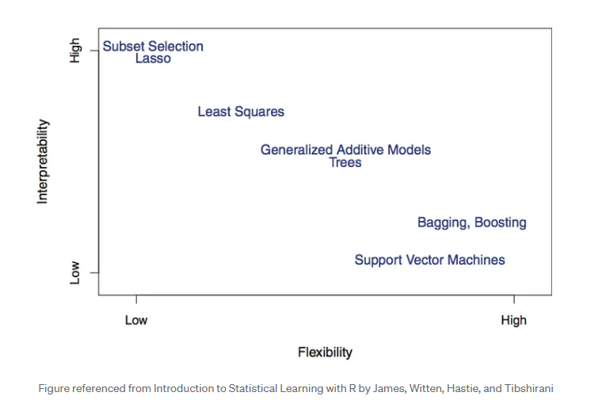

## 🔗 Quick-Reference Sources
- *Airbnb Case Study:* [Using Machine Learning to Predict Value of Homes on Airbnb](https://medium.com/airbnb-engineering/using-machine-learning-to-predict-value-of-homes-on-airbnb-9272d3d4739d)
- **Chip Huyen DMLS:** [Granular Bulleted Summaries (Ch. 7-9)](https://github.com/serodriguez68/designing-ml-systems-summary)
- **Drift Implementation Blueprint:** [Evidently AI ML Monitoring Guide](https://www.evidentlyai.com/ml-in-production/model-monitoring)

---

## 📝 Study Scratchpad

### Basic ML Review

A model is a function that turns inputs into outputs, which are then used to make predictions.  
    In supervised ML, inputs and outputs are given as data, and the function is derived from the data. Still need to specify the form that the function should take eg. linear function, decision tree, neural network  
Parameters are values for the model function that are learned during the training process.  
    Need an objective func to evaluate params, aka loss func  
    Also need learning procedure to derive the set of parameters best suited for data  
Model Selection isnot just selecting function. Also involves picking right objective function and learning procedure  
    while developing model, if time permits, you should experiment with diff objective funcs to see how model behaviour changes globally or for subsets of data  
    learning procedures (eg. gradient descent) and optimizers (eg. momentum/adam/rmsprop)  
    the set of params that perform well on training data aren't always the best, a diff set might perform better in production  
    

### Airbnb case study

Data products (eg.personalized search ranking for guests, smart pricing for hosts) are useful but costly to make.  
Advances in ML infra lowered the cost to deploy new ML models to production  
    - a general feature repository so that u can reuse features that u know are high quality (cuts time on feature engineering)  
    - AutoML tools being used by data scientists (speeds up model selection and performance benchmkarking)  
    - a framework to automatically translate Jupyter notebooks into Airflow pipelines  
Specific Case: LTV modeling - predicting the value of homes on airbnb  
    LTV -> Lifetime Value, projected currency value of a user for a fixed time horizon. Companies like Spotufy use it to make pricing decisions. Airbnb uses user's LTVs to:  
        allocate budget across diff marketing channels efficiently,   
        calc more precise bidding prices for online marketing based on keywords  
        create better listing segments
    Calculating historical value of existing listings can be done using past data, they decided to predict LTV of new listing using ML

#### ML Workflow for LTV Modeling    

Feature Engineering -> Model Training -> Model Selection & Validation -> Productionization  

##### Feature Engineering - Define relevant features
(airbnb's internal feature repo - Zipline)
one of the first step in any supervised ml project is to define relevant features, correlated w the outcome variable, aka feature engineering. eg. In predicting LTV u might compute the percent of the next 180 calendar dates that a listing is available or a listing's price relative to comparable listings in the same market  
Tedious - requires domain specific knowledge, not easily shareable/reusable
solution, Zipline - a training feature repository that provides features at diff levels of granularity (host, guest, listing, or market level). 
Crowdsourced, allowing data scientists to use features prepared/vetted by others for past projects. IF a feature is not available, a user can create their own. When multiple features are reqiured fora training set, zipline automaically performs key joins and backfills the training data behind the scenes. 
##### Prototyping and Training - Train a model prototype
Before fitting a model, data processing needs to happen. Data imputation to deal w missing values & encoding categorical variables (if few categories, one-hot-encoding. if many, ordinal encoding)
For prototyping, we don't know the best set of features to use so its important to write code that allows for rapid iteration.  
    The pipeline constuct is useful for prototyping. [Pipelines](http://scikit-learn.org/stable/modules/compose.html#pipeline-chaining-estimators) allow data scientists to specify high level blueprints that describe how features should be transformed and which models to train. At a high level, pipelines are used to specify data transformations for diff types of features.   
    The advantage of using pipelines is that:    
        1. data transformations are abstracted away     
        2. ensures that data is transformed consistently across training and scoring, solving the problem of data transformation inconsistency when translating a prototype into production     
        3. separate data transformations from model fitting
        4. data scientists can add a final step to specify an estimator for model fitting 
```python
# Example snippet from LTV model pipeline
            transforms = []

            transforms.append(
                ('select_binary', ColumnSelector(features=binary))
            ) # binary features can be appended directly 

            transforms.append(
                ('numeric', ExtendedPipeline([
                    ('select', ColumnSelector(features=numeric)),
                    ('impute', Imputer(missing_values='NaN', strategy='mean', axis=0)),
                ]))
            ) # numeric features need a pipeline to perform data imputation

            for field in categorical:
                transforms.append(
                    (field, ExtendedPipeline([
                        ('select', ColumnSelector(features=[field])),
                        ('encode', OrdinalEncoder(min_support=10))
                        ])
                    )
                ) #  categorical features need a pipeline to perform encoding
                
            features = FeatureUnion(transforms) # FeatureUnion simply combines the features columnwise to get the final training dataset
```  
##### Model Selection & Validation - Performing model selection and tuning    
need to decide which candidate model is the best to put into production     
to do so, weigh the tradeoffs bw model interpretability and complexity eg. sparse linear model might be v interpretable but not complex enough to generalize well, whereas a tree based model might be flexible enough to capture nonlinear patterns but not v interpretable. This is known as Bias-Variance tradeoff.  
    In applications such as insurance or credit screening, its imp for model to be transparent and interpretable to ensure fairness. In applications such as image classification, it is more imp to have a performant classifier than an interpretable model.  
To speed up the process of model selection, they experimented using various AutoML frameworks and found that XGBoost outperformed benchmark models significantly. Since the task was to predict listing values, they productionized their final model using XGBoost, which favors flexibility over interpretability.   
##### Productionization - Take the selected model prototype to production  
ML Automator - Airbnb's notebook translation framework  
building a production pipeline way more complex than a prototype on a local laptop:  
1. how to perform periodic re-training?  
2. how to score a large no of examples efficiently?  
3. how to build a pipeline to monitor model performance over time?

ML Automator was built to automatically translate a jupyter notebook into an Airflow ML pipeline. This framework was designed specifically for data scientists who are already familiar w writing prototypes in python and want to take their model to production w limited exp in data engineering.  
The requirements for this framework are: user must specify a model config in the notebook to tell the framework where to locate training table, how many resources to allocate for training and how scores will be computed, and secondly data scientists are required to write specific fit and transform functions. fit() specifies exactly how training will be done. transform() will be wrapped as a python UDF for distributed scoring if needed. 
ML Automator wraps the notebook inside a python udf and creates and airflow pipeline. Data engineering tasks such as data serialization, scheduling of periodic re-training, distributed scoring, are all encapsulated as a part of this daily batch job. This significantly lowers the cost of model development for data scientists, like a dedicated data engineer to help w productionization.   
##### Topics not covered    
Tracking model performance over time, leveraging elastic compute environment for modeling etc.  

#### Final Takeaways  
1. Thanks to the collaboration of data scientists and ML infra, the cost of model development is significantly lower. Zipline - feature engineering, Pipeline - model prototyping, AutoML - model selection & benchmarking, ML Automator - productionization.  
2. Notebook driven design reduces barrier to entry. Notebooks used in production are guaranteed to be correct, self-documenting and up-to-date, resulting in strong adoption from new users.  
3. Teams are willing to invest more in ML product ideas. 


### DMLS CH6

##### 
