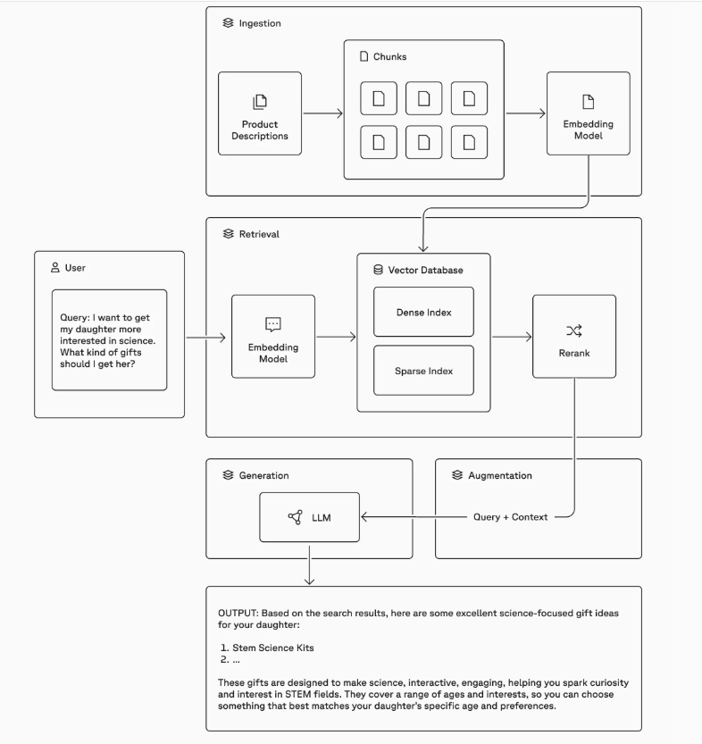
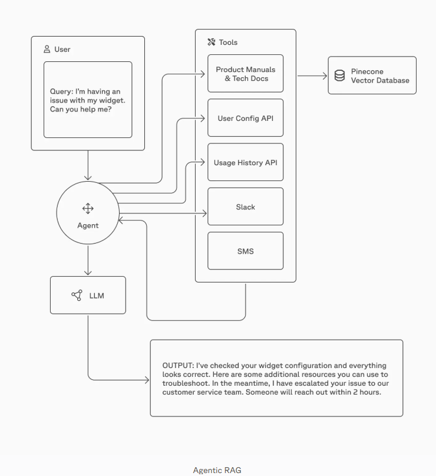

# 🔗 Quick-Reference Sources
- **RAG Guide:** [Pinecone — RAG Guide](https://www.pinecone.io/learn/retrieval-augmented-generation/)
- **Building RAG pipeline:** [Building a reliable, curated, and accurate RAG system with Cleanlab and Pinecone](https://www.pinecone.io/learn/building-reliable-curated-accurate-rag/)
- **LoRA & QLoRA:** [Sebastian Raschka — LoRA explained](https://sebastianraschka.com/blog/2023/llm-finetuning-lora.html)
- **LangChain agents:** [LangChain — Quickstart](https://python.langchain.com/docs/get_started/quickstart)
- **RAG evaluation:** [RAGAS Documentation](https://docs.ragas.io/en/latest/)

# 📝 Study Scratchpad

## RAG 

### Limitations of foundation models:
- knowledge cutoff, does not have recent /realtime info
- lacks depth when it comes to domain specific knowledge
- public models do not (thankfully) have access to privte/proprietary data, but this can make them less useful for custom business purposes
- unreliable sources, especially if the model cannot cite them
- hallucinations can come from models that are trained on a diverse set of data that may contian contradictions, errors and ambiguous data. output generation is inherently probabilistic, and incomplete/inaccurate data can be dangerous

### What is RAG 
technique that uses authoritative external data to imporve the accuracy, relevancy and usefulness of a model's output.  
made up of 4 components: Ingestion, Retrieval, Augmentation, Generation.  
  
combine relevant data from an external data source with the user's query -> give it to the model as context, model is able to generate more relevant output along with the following advantages:
- access to real-time/proprietary/domain-specific data
- more trustworthy
- better control over the sources used as well as stuff like safety guardrails and retrieval strategies
- more cost effective than retraining/fine-tuning or stuffing the context sent to larger foundation models 

### Agentic workflows w RAG
Traditional RAG -> simple. vector database + one-shot prompt w context sent to model  
now with ai agents, agents are orchestrators of the core RAG components, to
- construct more effective queries
- access additional retrieval tools
- evaluate accuracy and relevance of the retrieved context 
- apply reasoning to validate the info retrieved  
thee operations can be performed by an agent (or multiple) as part of a large interative plan. using agents as orchestrators of RAG allows better review, queries, nd validation of the retrieved info, which lets the agents make better more informed decisions

### How does RAG work 
How to know when AI app is working -> identify a set of queries and their expected answers, for evaluation purposes  
other improvements alongside RAG -> query rewriting, chunk expansion, knowledge graphs

4 main components of RAG: Ingestion, Retrieval, Augmentation, Generation

#### Ingestion
Traditional RAG -> simple. retrieve data from vector database, using semantic search to find the true meaning of the user's query instead of j matching keywords   
Before retrieval, you need to ingest the data. Steps for that are as follows
1. Chunk the data: 
    - chunking is the process of breaking down large text into smaller segments called chunks
    - the trick is in finding chunks that are large enough to contain meaningful information whilesmall enough to enable performant apps and low latency respones for rag and agentic workflows. 
    - 2 main reasons for chunking:
        1. to ensure embedding models can fit the data into their context windows
        2. to ensure the chunks themselves contain the info necessary for search 
    - 2 main roles of chunking:
        1. semantic search -> indexing a corpus of documents requires chunking them, and similarity is determined by chunk level comparisons to the input query vector. chunking strategy needs to ensure that the chunk of text makes sense without the surrounding context to a human, to ensure search results accurately capture the essence of a user's query
        2. agentic apps and rag -> agents need access to up-to-date info from databases in order to call tools/make decisions/respond to queries. embedded chunks are used to build the context based on a knowledge base the agent has access to, so that the agent is grounded in trusted information and doesn't hallucinate or call the wrong tools.
        3. long context llms -> when using models with a large xontext window, unchunked large documents may still fit but using large chunks leads to increased latency and costs in downstream responses. long context embedding and llm models suffer from lost-in-the-middle problem, where relevant info buried inside long documents is missed. this can be fixed by chunking the appropriate amt of information to pass to a downstream llm which reduces latency and ensures quality
    - questions to ask when considering chunking strategy:
        - what kind of data is being chunked? small docs (tweets, product descriptions, chat msgs) may not need to be chunked at all, whereas long docs (articles, books) may have a chapter structure that informs ur chunking strategy
        - which embedding model are u using? diff models have diff capacities for information, and suited for diff domains. pick a model that is suitable for ur domain and then chunk according to the document types the model has been trained on
        - what are ur expectations for user queries (length, complexity)? short and specific vs long and complex, chunk accordingly to increase correlation bw the embedded query and embedded chunks
        - how will the retrieved results be used in ur specific application? semantic search/question answering/rag/agentic workflow? determines how ur data should be represented within the vector database
    - embedding short vs long content: when short content like a sentence is embedded, the resulting vector focuses on the sentence's specific meaning, which is useful when the vector search is used for senence-level classification. in cases where sentences are considered individual documents, no chunking is needed at all. on the other hand, long content like a paragraph or a full doc is embedded in a way that considers both the overall context and the reltionships bw the sentences and phrases within the text. it capture the broader and themes of the text but dilutes the significance of indiviual sentences/phrases, making finding precise matches more difficult. 
    - chunking methods:
        1. fixed-size chunking -> most common & straightforward. fix no of tokens per chunk, and break up document into fixed size chunks (usually this no is the max context window size of the embedding model). this method is usually sufficient, so start here and move to others only after deeming this inefficient
        2. content-aware chunking -> fixed-size chunking may ignore critical structure within documents. 
            - sentence and paragraph splitting using naive splitting, NLTK or spaCy
            - recursive character level chunking tries to split text using separators in a given order. by default, the langchain one uses ["\n\n", "\n", " ", ""] separators to break paragraphs, sentences, and words depending on a given chunk size. this is a good middle ground bw always splititng on a specific character while ensuring fixed chunk sizes when possible
            - document structure based chunking is useful w large docs like PDFs DOCX HTML MD LaTeX and code snippets when u want to preserve the original structure of the content during chunk creation. eg. headers/tables/images in PDFs, paragraph tags in HTML, sections in LaTeX etc.
            - semantic chunking uses semantic analysis to create chunks that are made up of sentences that talk about the same topic. involves breaking a document into sentences, grouping each sentence with its surrounding sentences and generating embeddings for these groups. comparing the semanic distance bw each group and its predecessor allows u to identify where the topic/theme shifts, informing the chunk boundaries
            - contextual chunking with llms. sometimes its not possible to chunk from a larger document wihtout losing context entirely eg. when topics require understanding from many related portions of the document. anthropic introduced contextual retrieval which appends a contextualized description to each chunk before embedding it, which helps retain a high-level summary meaning of the document to the chunk for incoming queries. to avoid processing the document every time, this description is cached within the prompt for all necessary chunks. 
    - figuring out the best chunking strategy for your app involves selecting a range of potential chunk sizes from small (eg. 128 or 256 tokens) to capture more granular info to large (eg. 512 or 1024 tokens) for retaining more context, usually after data preprocessing, and then evaluate the performance of each chunk size.
    - chunk expansion -> when querying information, agents or llms may need more surrounding context to interpret the chunk adequately, so chunk expansion also retrieves the neighbouring chunks for each chunk in the retrieved set. coupling a chunking strategy w a good chunk expansion on querying can ensure low latency searches without compromising on quality
2. Create vector embeddings: Once your data is chunked, then you use an embedding model to embed each chunk before loading it into the vector databse (embedding model is a special type of llm that converts the data chunk into a vector embedding, aka a numerical representation of the data's meaning, allowing computers to search for similar items based on the vector representation of data)
3. Load data into a vector database: Once u have vectors, u load them into a vector database. this step usually happens offline and indepent of ur application. however, if the data changes, you can update the index in real-time to provide up to date info to ur users 

### Retrieval 
Simple approach -> using semantic search alone  
Hybrid search -> semantic search (w dense vectors) + lexical search (w [sparse vectors](https://www.pinecone.io/learn/sparse-retrieval/)) improves the search results even more  
This becomes relevant when ur users dont always use the same language to talk abt a topic (semantic search) and they refer to internal, domain specific language (lexical/keyword search) like acronyms, product names or team names.  

During retrieval, a vector embedding is created from the user's query to search against the vectors in teh database. In [hybrid search](https://docs.pinecone.io/guides/search/hybrid-search), you'll query either a single hybrid index, or both a dense and a sparse inex, then we combine and de-duplicate the results and use a re-ranking model to [rerank](https://www.pinecone.io/learn/refine-with-rerank/) them based on a unified relevance score. according to this ranking u then return the most relevant matches. 

### Augmentation 

With the most relevant matches from the retrieval step, you can create an augmented prompt containing both the search results and the user's query and send that to the LLM. Example prompt:
````
QUESTION:
<the user's question>

CONTEXT:
<the search results to use as context>

Using the CONTEXT provided, answer the QUESTION. Keep your answer grounded in the facts of the CONTEXT. If the CONTEXT doesn't contain the answer to the QUESTION, say you don't know.
````

### Generation 

Using the augmented prompt, the LLM now has access to the most pertinent and grounding facts from your vector database so your application can provide an accurate answer for the user and reduces likelihood of hallucination.  
Traditional RAG -> searching for the right piece of information to inform a model response  
Agentic RAG -> Deciding which questions to ask, which tools to use, when to use them, and then aggregating results to good answers  
  
The LLM is the agent and decides which retrieval tools to use and when and how to query those tools

## Langchain Academy - Intro to Langchain

agentic -> ability to take actions autonomously

module 1 -> basics. customizing llm, out of the box arguments, system prompts, tools & short term memory. project : personal chef
module 2-> mcp, customized memory, multi agent systems. project: wedding planner team
module 3 -> using middleware, human in the loop, summarize long conversations. project: email assistant
chat interface to demo agent
